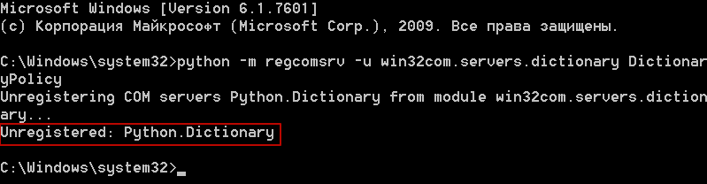

.. meta::
	:description: Пакет regcomsrv позволяет регистрировать COM сервера, используя командную строку.
	:keywords: regcomsrv пакет регистрация COM сервер объект командная строка

.. _overview:

Обзор
=====
Пакет ``regcomsrv`` позволяет регистрировать и отменять регистрацию COM серверов, используя командную строку.

.. _setup:

Установка
---------
С помощью pip::
	
	pip install regcomsrv
	
.. attention::

	Пакет ``regcomsrv`` требует установки пакета ``pypiwin32`` и устанавливает его автоматически. Однако если в процессе установки возникнут ошибки, сообщающие о том, что необходимые пакеты не установлены, то установите их с помощью pip::
		
		pip install pypiwin32 
		
	Или используйте дистрибутив, который можно скачать по сслыке `https://sourceforge.net/projects/pywin32/files/pywin32/ <https://sourceforge.net/projects/pywin32/files/pywin32/>`_.
	

.. usage:

Как использовать?
-----------------
Если у вас есть какой-нибудь COM сервер, реализованный на языке Python, то установите пакет ``regcomsrv``, откройте командную строку и наберите::

	python -m regcomsrv "<module>" "<class>"
	
где:

* *<module>* - имя модуля, в котором находится класс, реализующий COM сервер.
* *<class>* - имя класса, реализующего COM сервер.

.. _register-example:

Пример регистрации COM сервера
~~~~~~~~~~~~~~~~~~~~~~~~~~~~~~
Допустим, требуется зарегистрировать COM сервер ``Python.Dictionary``, который реализуется классом ``DictionaryPolicy``, определенном в модуле ``win32com.servers.dictionary``. Для этого в командной строке нужно набрать::

	python -m regcomsrv win32com.servers.dictionary DictionaryPolicy
	
После выполнения команды на консоль будет выведено сообщение, что COM сервер ``Python.Dictionary``, был успешно зарегистрирован.

.. figure:: _static/register-python-dictionary.png
	:scale: 100%
	:alt: Регистрация COM сервера Python.Dictionary
	:align: center

	Регистрация COM сервера Python.Dictionary

	
.. _unregister-example:

Пример отмены регистрации COM сервера
~~~~~~~~~~~~~~~~~~~~~~~~~~~~~~~~~~~~~
Чтобы отменить регистрацию COM сервера, нужно использовать параметр командной строки ``--unregister`` или его сокращенный вариант ``-u``::

	python -m regcomsrv -u win32com.servers.dictionary DictionaryPolicy
	
После выполнения команды на консоль будет выведено сообщение, что регистрация COM сервера ``Python.Dictionary``, была успешно отменена.

	Отмена регистрации COM сервера Python.Dictionary
	