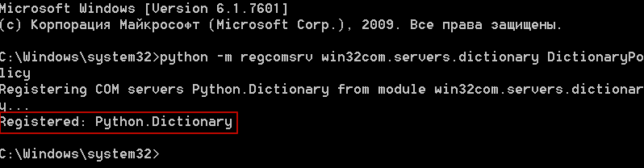
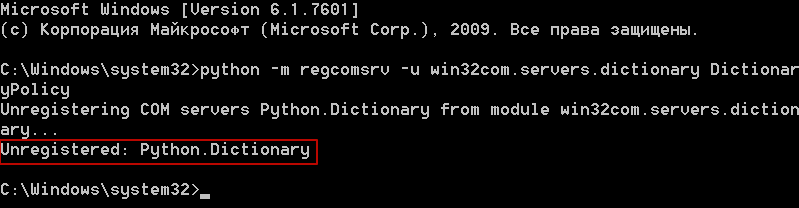
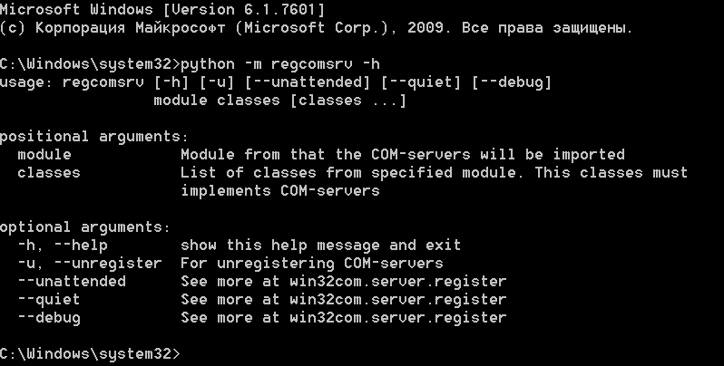

.. meta::
	:description: Регистрируйте и отменяйте регистрацию COM серверов, используя командную строку.
	:keywords: регистрация отмена COM сервер командная строка параметры

.. _reg-with-command-line:

Регистрация COM серверов с помошью командной строки
===================================================
Вы можете использовать командную строку, чтобы регистрировать или отменять регистрацию COM серверов.

Модуль ``regcomsrv`` поддерживает следующие параметры коммандной строки:

* Позиционные аргументы:
	
	* ``module`` - модуль, из которого будут импортированы классы, реализующие COM сервера.
	* ``classes`` - список классов, реализующих COM сервера.
	
* Необязательные аргументы:

	* ``-h``, ``--help`` - показать справку по команде.
	* ``-u``, ``--unregister`` - если указан, то будет выполнена отмена регистрации COM сервера.
	* ``--unattended`` - смотри подробнее в модуле ``win32com.server.register``.
	* ``--quiet`` - смотри подробнее в модуле ``win32com.server.register``.
	* ``--debug`` - смотри подробнее в модуле ``win32com.server.register``.
	

.. _reg-com-server-cmd:

Регистрация COM сервера
-----------------------
Чтобы зарегистрировать COM сервер, откройте командную строку и наберите::

	python -m regcomsrv win32com.servers.dictionary DictionaryPolicy
	
После выполнения команды на консоль будет выведено сообщение, что COM сервер успешно зарегистрирован.

	
	Регистрация COM сервера
	
	
.. _unreg-com-server-cmd:

Отмена регистрации COM сервера
------------------------------
Чтобы отменить регистрацию COM сервера, откройте командную строку и наберите::

	python -m regcomsrv -u win32com.servers.dictionary DictionaryPolicy

После выполнения команды на консоль будет выведено сообщение, что регистрация COM сервера успешно выполнена.

	
	Отмена регистрации COM сервера
	
	
.. _show-help:

Вызов справки
-------------
Чтобы вызвать справку по команде, откройте командную строку и наберите::

	python -m regcomsrv -h
	
После выполнения команды на консоль будет выведена справка.

	
	Справка по команде