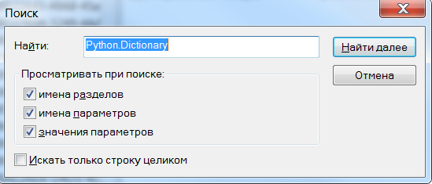
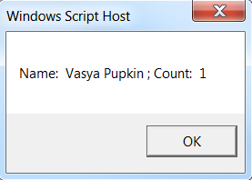
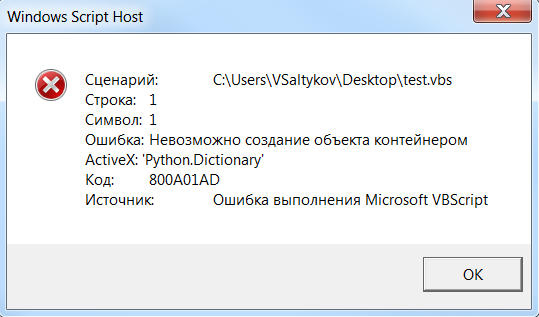

.. meta::
	:description: При регистрации COM сервера некоторая информация о нем заносится в реестр Windows.
	:keywords: COM сервер регистрация отмена реестр windows

.. _registry:

COM сервер и реестр Windows
===========================
Когда вы регистрируете какой-либо COM сервер, то некоторая информация о нем регистрируется в реестре Windows. После отмены регистрации эта информация из реестра удаляется.

Давайте зарегистрируем COM сервер ``Python.Dictionary``, который реализуется классом ``DictionaryPolicy``, определенном в модуле ``win32com.servers.dictionary``::

	python -m regcomsrv win32com.servers.dictionary DictionaryPolicy
	
Теперь откроем реестр и выполним поиск по ``Python.Dictionary``.

	
	Поиск в реестре Windows
	
Выполнив поиск по реестру мы сможем найти раздел ``HKEY_CLASSES_ROOT\Wow6432Node\CLSID\{39b61048-c755-11d0-86fa-00c04fc2e03e}``, в котором содержатся некоторые подразделы с параметрами, содержащими некоторую информацию о зарегистрированном COM сервере. Наличие подраздела с именем ``LocalServer32`` говорит о том, что COM сервер зарегистрирован, как локальный сервер, и будет выполняться по средствам запуска через интерпретатор Python скрипта ``localserver.py`` с параметром ``{39b61048-c755-11d0-86fa-00c04fc2e03e}``, который является ``CLSID`` зарегистрированного COM сервера.

.. _work-checking:

Запуск COM сервера
------------------
Теперь давайте создадим файл ``*.vbs`` и наберем в нем код:

.. code-block:: vbnet

	Set oPyDict = CreateObject("Python.Dictionary")
	
	oPyDict("name") = "Vasya Pupkin"
	WScript.echo "Name: ", oPyDict("name"), ";", "Count: ", oPyDict.Count
	
После его выполнения мы увидим окно windows - COM сервер работает!

	
	Запсук COM сервера на VB
	

.. _auto-clear-registry:

Отмена регистрации COM сервера и очистка реестра Windows
--------------------------------------------------------
Отменим регистрацию COM сервера ``Python.Dictionary``, выполнив в командной строке::

	python -m regcomsrv -u win32com.servers.dictionary DictionaryPolicy
	
После этого снова откроем реестр Windows и выполним поиск по ``Python.Dictionary`` - мы увидим, что в реестре отсутствуют какие-либо записи с вхождением ``Python.Dictionary``. Таким образом, отмена регистрации COM сервера автоматически очищает реестр от лишней информации.

Если мы снова попробуем выполнить указанный выше код VB, то мы увидим, что запрашиваемый нами COM сервер не зарегистрирован, и нет возможности создать его экземпляр.

	
	Ошибка VB при вызове незарегистрированного COM сервера